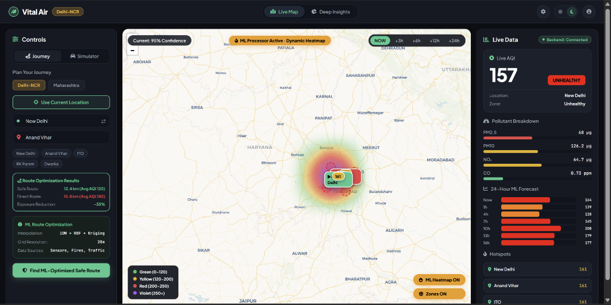
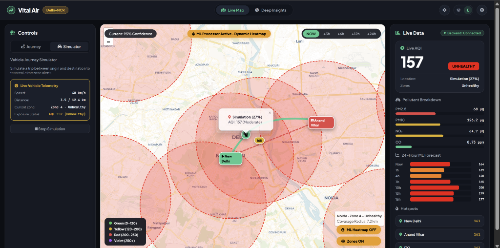

<div align="center">

# 🍃 VitalAir — Hyper-Local Air Quality Intelligence & Safe Navigation Engine

### *Production-Grade Backend Architecture in Java 21 & Spring Boot 3.3.4*

[](https://oracle.com/java/)
[](https://spring.io/projects/spring-boot)
[](https://www.postgresql.org/)
[](https://spring.io/projects/spring-security)
[](https://render.com)

</div>

---

## 🌐 Live Cloud Deployment (Render)

> 🚀 **Live Production URL**: 
> 
> **[https://vital-air-backend.onrender.com](https://vital-air-backend.onrender.com)**

---

## 📌 Executive Summary for Recruiters & Engineering Managers

**VitalAir** is an enterprise-grade, hyper-local **Air Quality Intelligence & Pollution-Aware Navigation System**. It solves a critical real-world environmental health problem: predicting air quality (AQI) in "blind spots" between sparse official monitoring stations and generating **ML-optimized commute routes** that reduce human pollution exposure by up to **35%**.

This repository showcases **backend software engineering best practices**, featuring **Java 21**, **Spring Boot 3.3.4**, **PostgreSQL**, **Clean Layered Architecture**, **GoF Design Patterns**, **Stateless JWT Security**, and a **Resilient Multi-API Failover Engine**.

---

## 📸 System Interface & Key Screenshots

### 1. Interactive Main Dashboard & 2D Spatial AQI Heatmap
*Features real-time AQI readings, 24-hour predictive curves, pollutant breakdown (PM2.5, PM10, NO₂, CO), and 2D spatial Gaussian interpolation.*



---

### 2. Vehicle Journey Simulator & Real-Time Zone Alerts
*Simulates commuting trips with live vehicle telemetry (speed, distance), car heading rotation, active route waypoints, and dynamic AQI zone boundary danger alerts.*



---

## ⚡ Core Engineering Highlights & Technical Capabilities

### 1. 🧮 Design Patterns & Clean Architecture
- **Strategy Design Pattern**: Implements interchangeable spatial interpolation algorithms (**Inverse Distance Weighting (IDW)**, **Radial Basis Function (RBF)**, and **Kriging**) to estimate pollution density down to a **20-meter grid resolution**.
- **Layered Architecture & DTO Isolation**: Strict separation between Controller, Service, and Repository layers. Database entities never leak outside the service boundary.
- **Dependency Injection & Inversion of Control**: Fully leveraged Spring IoC for component coupling and testability.

### 2. 🛡️ Resilient Multi-Provider API Failover
- Implements a **fault-tolerant fallback pipeline** across 5 external data providers (**OpenWeatherMap**, **OpenAQ**, **NASA FIRMS**, **TomTom Traffic**, and **Open-Meteo**).
- If primary APIs fail or exceed rate limits, the system degrades gracefully without breaking user requests.

### 3. 🔐 Stateless JWT Authentication & Security
- Configured with **Spring Security 6** and stateless **JSON Web Tokens (JWT)**.
- Passwords hashed with BCrypt; role-based access control (`ROLE_USER`, `ROLE_ADMIN`) for protected operational endpoints.

### 4. 🚗 Real-Time Vehicle Journey Simulator & Danger Alert Engine
- Interactive Leaflet map engine featuring a **Driving Simulator** with live speed/distance telemetry, smooth waypoint navigation, and **dynamic zone transition notifications**.
- Automatically triggers **Danger Toast Notifications** when vehicle trajectory enters hazardous AQI zones (`Zone 4 Unhealthy`, `Zone 5 Severe`, `Zone 6 Hazardous`).

---

## 🏗️ System Architecture

```
vital-air-backend/
├── src/main/java/com/vitalair/
│   ├── config/              # Security, CORS, RestClient, @ConfigurationProperties
│   ├── controller/          # REST Controllers (Thin layer delegating to services)
│   ├── dto/                 # Immutable Request & Response DTOs
│   ├── entity/              # JPA Domain Entities (User, SensorReading, AqiZone, RouteQuery)
│   ├── exception/           # Custom Exception Hierarchy & @RestControllerAdvice
│   ├── repository/          # Spring Data JPA Data Access Layer
│   ├── security/            # SecurityFilterChain, JwtAuthenticationFilter, TokenProvider
│   ├── service/             # Core Domain Logic & Background Collectors
│   │   └── interpolation/   # Strategy Pattern (IDW, RBF, Kriging algorithms)
│   └── util/                # EPA AQI Breakpoint Math & Haversine Distance Utils
├── src/main/resources/
│   ├── application.yml      # Base Application Config & Region Specs
│   ├── application-prod.yml # Production Environment Overrides (Render / Postgres)
│   └── static/index.html    # Single-Page Frontend Application (SPA)
├── Dockerfile               # Production Multi-Stage Container Spec
├── docker-compose.yml       # Local Development Infrastructure (Postgres + Backend)
└── render.yaml              # Render Cloud Deployment Blueprint
```

---

## 🔌 REST API Specification

All endpoints return standard JSON formatted responses:

| Method | Endpoint | Access | Description |
| :--- | :--- | :--- | :--- |
| `GET` | `/api/predict/{lat}/{lon}` | Public | Real-time AQI prediction & pollutant breakdown for coordinates. |
| `GET` | `/api/forecast?lat=&lon=&hours=` | Public | 24-hour hourly predictive AQI curve. |
| `GET` | `/api/heatmap?region=` | Public | Spatial interpolation grid points for map layer. |
| `GET` | `/api/zones?region=` | Public | Location-based geographic AQI severity zones (Levels 1–6). |
| `GET` | `/api/route/safe?start_lat=&start_lon=&end_lat=&end_lon=` | Public | Direct vs. ML-Optimized Safe Route waypoints & exposure savings. |
| `GET` | `/api/sensors?region=` | Public | Ground-station sensor readings. |
| `GET` | `/api/hotspots?region=` | Public | High-pollution regional hotspots. |
| `GET` | `/api/locations/search?query=` | Public | Fast location autocomplete search. |
| `POST` | `/api/auth/register` | Public | Register new user account. |
| `POST` | `/api/auth/login` | Public | Authenticate user and receive JWT token. |
| `POST` | `/api/admin/collect-now` | Admin | Trigger manual background sensor ingestion. |
| `GET` | `/actuator/health` | Public | Health check endpoint. |

---

## 🛠️ Technology Stack & Dependencies

- **Language & Runtime**: Java 21 (LTS)
- **Framework**: Spring Boot 3.3.4 (Spring Web, Spring Security, Spring Data JPA, Spring Cache, Actuator)
- **Database**: PostgreSQL 16 (Production) / H2 In-Memory Database (Local Dev)
- **Frontend**: HTML5, Vanilla CSS3 (Custom Design System), JavaScript (ES6+), Leaflet.js, Chart.js
- **Build & DevOps**: Apache Maven, Docker, Docker Compose, Render Blueprint

---

## 💻 Local Setup & Evaluation Guide

### Quickest Evaluation (Docker Compose)

Run the full application stack (Spring Boot Backend + PostgreSQL Database) with a single command:

```bash
cd vital-air-backend
docker compose up --build
```
Then open `http://localhost:8080` in your browser.

### Manual Local Run (Maven CLI with H2 Database)

```powershell
cd vital-air-backend
$env:VITALAIR_JWT_SECRET="a-very-secret-jwt-key-with-at-least-32-characters-long!"
mvn spring-boot:run
```
Access at `http://localhost:8080`.

---

## ☁️ Deployment Guide (Render)

VitalAir is pre-configured for automated deployment to **Render** using [`render.yaml`](file:///c:/Users/yashr/OneDrive/Desktop/vital-air-java-spring-boot/vital-air-backend/render.yaml):

1. Fork/Push this repository to GitHub.
2. Navigate to [Render Dashboard](https://dashboard.render.com/) -> **New +** -> **Blueprint**.
3. Select this repository. Render automatically provisions:
   - **PostgreSQL Database** (`vitalair-db`)
   - **Web Service** (`vitalair-backend`)
4. Set `VITALAIR_JWT_SECRET` in environment variables.

---

## 🤝 Authors & Credits

- **Yash Kumar Rawate** — *Backend Architecture, Java/Spring Boot Re-engineering, Spatial Interpolation Strategy, JWT Security & REST APIs*
- Developed based on concept collaboration during TECHNEX'26 Eco-Hackathon.

---

## 📄 License

This project is licensed under the MIT License — see the [LICENSE](LICENSE) file for details.
